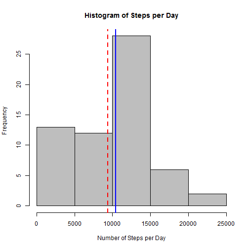
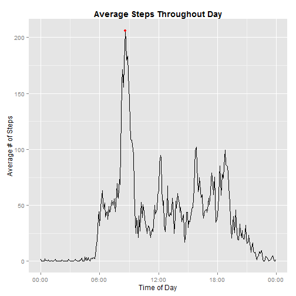
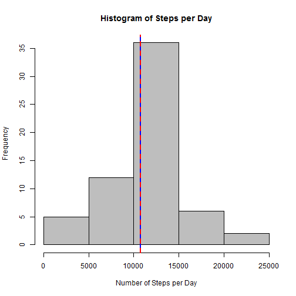
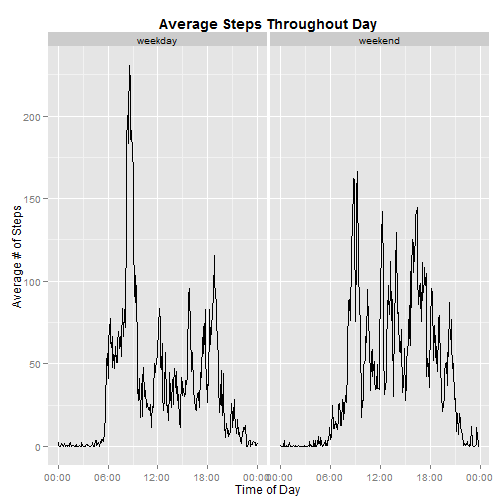

_Dataset: [Assignment Data](https://d396qusza40orc.cloudfront.net/repdata%2Fdata%2Factivity.zip)_

##Preparing & Loading Data

First, we'll set global options to ensure all code and output will be displayed,
and load the plyr, dplyr, ggplot2 and scales packages for later analysis:


```r
if(!require(plyr)) {install.packages("plyr"); library(plyr)}
if(!require(dplyr)) {install.packages("dplyr"); library(dplyr)}
if(!require(ggplot2)) {install.packages("ggplot2"); library(ggplot2)}
if(!require(scales)) {install.packages("scales"); library(scales)}
if(!require(knitr)) {install.packages("knitr"); library(knitr)}

# Set global options to display code and output:
opts_chunk$set(echo = TRUE, results = "asis")
```

Next, we download and the activity data and load it into memory.


```r
if (!file.exists("./repdata-data-activity.zip")) {
      download.file(url = "https://d396qusza40orc.cloudfront.net/repdata%2Fdata%2Factivity.zip",
                    destfile="./repdata-data-activity.zip")
      unzip(zipfile = "./repdata-data-activity.zip")
}

rdata <- read.csv("./activity.csv")

## adjust the interval variable to more clearly represent time values
t <- sprintf("%04d",rdata$interval)
rdata$timeint <- as.POSIXct(t, tz = "EST", format = "%H%M")
```

##Part 1: Explore Steps by Day

In order to determine the distribution of steps per day, we need to aggregate
the step count across each day. For the time being, we will ignore NA values.


```r
daysteps <- rdata %>%
      group_by(date) %>%
      summarise(aggsteps = sum(steps, na.rm = TRUE))
```

We can then explore the distribution of steps per day through a histogram:


```r
hist(daysteps$aggsteps, col = "grey", main = "Histogram of Steps per Day",
     xlab = "Number of Steps per Day")

meansteps <- mean(daysteps$aggsteps)
medsteps <- median(daysteps$aggsteps)

abline(v = meansteps, col = "red", lty = 2, lwd = 2)
abline(v = medsteps, col = "blue", lty = 1, lwd = 2)
```

 

The mean number of steps per day is 9,354.23 and the meadian is 10,395, 
indicated by the dashed red line and the solid blue line, respectively, in the 
histogram above.

##Part 2: Explore Daily Activity Pattern

Next, we will evaluate the daily step pattern by calculating the mean steps
for each interval across all days. Again, we are ignoring NA values for the 
time being.


```r
intsteps <- rdata %>%
      group_by(timeint) %>%
      summarise(avgsteps = mean(steps, na.rm = TRUE))
```

The following plot illustrates the average steps taken per daily interval:


```r
p <- ggplot(intsteps, aes(timeint, avgsteps)) + geom_line() + 
      labs(title = "Average Steps Throughout Day", 
             x = "Time of Day", y = "Average # of Steps") + 
      theme(plot.title = element_text(size = 14, face = "bold")) +
      scale_x_datetime(labels = date_format(format = "%H:%M"))

maxsteps <- max(intsteps[,2])
maxint <- intsteps[which(intsteps[,2] == maxsteps), ]$timeint

p <- p + annotate("pointrange", x = maxint, y = maxsteps, 
                  ymin = maxsteps, ymax = maxsteps, col = "red")

print(p)
```

 

As indicated by the red point in the above line plot, on average a daily 
maximum of 206.17 steps are logged in the interval beginning
at 08:35.

##Part 3: Addressing Missing Values

Unfortunately, there are a significant number of missing values, which may
distort our overall analysis.


```r
numNA <- sum(is.na(rdata$steps))
```

In total, we count 2304 NA values. To address these missing values, we will 
assume that the missing values for a given day-interval combination are 
equivalent to the average number of steps for that interval across all other 
days (i.e. days where values are available, calculated for the line plot above).


```r
moddata <- join(rdata, intsteps, by = "timeint")

moddata[is.na(rdata$steps), "steps"] <- moddata[is.na(rdata$steps), "avgsteps"]

moddaysteps <- moddata %>%
      group_by(date) %>%
      summarise(aggsteps = sum(steps))
```

We can now visualize the impact of imputing values from the daily averages
where they were missing in the original data set. The following histogram


```r
hist(moddaysteps$aggsteps, col = "grey", main = "Histogram of Steps per Day",
     xlab = "Number of Steps per Day")

modmeansteps <- mean(moddaysteps$aggsteps)
modmedsteps <- median(moddaysteps$aggsteps)

abline(v = modmedsteps, col = "blue", lty = 1, lwd = 2)
abline(v = modmeansteps, col = "red", lty = 2, lwd = 2)
```

 

The mean number of steps per day after modification is 10,766.19 and 
the meadian is 10,766.19, indicated by the dashed red line and the solid 
blue line, respectively, in the histogram above; moderately higher than the
mean and median in our original sample with NAs.

##Part 4: Differentiating Weekend and Weekday Patterns

Lastly, we will investigate whether or not activity patterns differ during
weekedays versus on weekends. To do so, we will need to create a separate 
variable to differentiate between weekdays and weekend days.


```r
moddata$wday <- weekdays(as.POSIXlt(moddata$date))
moddata$dayofweek <- as.numeric(strftime(as.POSIXlt(moddata$date),"%u"))

moddata$weekpart <- "weekday"
moddata[moddata$dayofweek > 5, ]$weekpart <- "weekend"

moddata$weekpart <- as.factor(moddata$weekpart)
```

To evaluate by the part of the week (i.e., weekday vs. weekend), we will 
next need to summarize the data by the interval and new weekpart factor variable.


```r
modintsteps <- moddata %>%
      group_by(timeint, weekpart) %>%
      summarise(avgsteps = mean(steps))
```

We can then view any differences in weekday or weekend patterns through a
line plot:


```r
mp <- ggplot(modintsteps, aes(timeint, avgsteps)) + geom_line() + 
      facet_grid(. ~ weekpart) + 
      labs(title = "Average Steps Throughout Day", 
             x = "Time of Day", y = "Average # of Steps") + 
      theme(plot.title = element_text(size = 14, face = "bold")) +
      scale_x_datetime(labels = date_format(format = "%H:%M"))

print(mp)
```

 

This analysis suggests that peak activity occurs on weekday mornings, but 
a higher level of activity occurs generally throughout the mid-day period
(e.g. 7:30am - 6pm). 
